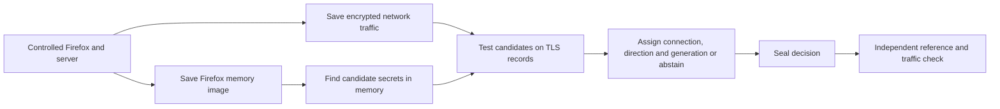
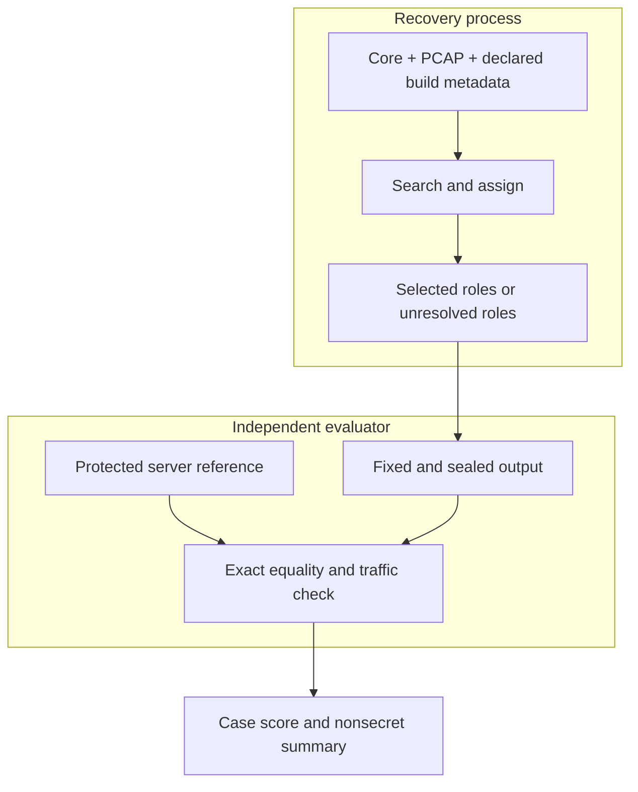
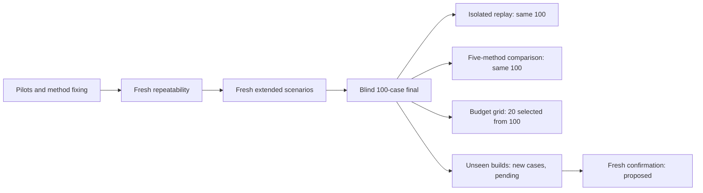

# TLS Snapshot Mapper: Saved-Memory Recovery of Firefox TLS Secrets

**Research report draft | Janith Shanilka Geekiyanage Don | 4 October 2026**

**Evidence cut-off:** records available in this repository through 4 October 2026.

**Status:** completed findings are separated from proposed work. This is a readable thesis draft, not a claim that the remaining evaluation is complete.

## Plain-language summary

When a browser uses TLS, the traffic on the network is encrypted. The browser must nevertheless hold temporary secret information in memory while it communicates. This project asks whether an investigator who has **a saved copy of the browser's memory** and **the matching saved network traffic** can find the right secret and identify the connection, direction and stage to which it belongs. The experiments use a Firefox browser and servers operated by the researcher. They do not obtain secrets from network traffic alone or break TLS mathematics.

The main approach looks for the way Firefox's NSS security library stores candidate values in memory. It then tests those candidates against the saved encrypted records. A candidate is accepted only when the records authenticate; if the evidence does not identify one answer, the system leaves the target unresolved. An independent evaluator checks the answer against a protected server reference **after** the recovery decision has been fixed.

The strongest completed experiment is a 100-case blind TLS 1.3 study using saved Firefox 136.0.2 memory and two or three overlapping connections. The structured method completed all 70 positive cases, recovered all 350 required positive targets and handled all 30 controls correctly. An entropy-only search completed none of the 70 positive cases within the declared search limit. These are findings from a controlled dataset and a specific machine/software configuration. Results on other Firefox builds and a new confirmation set were still pending at the evidence cut-off [S1–S5].

---

## Table of Contents (TOC)

1. [Refined Introduction Chapter](#1-refined-introduction-chapter)
2. [Refined Literature Review](#2-refined-literature-review)
3. [Research Approach / Methodology](#3-research-approach--methodology)
4. [Research Design](#4-research-design)
5. [Preliminary Results / Discussion](#5-preliminary-results--discussion)
6. [Evaluation Plan](#6-evaluation-plan)
7. [Current Progress / Refined Project Timeline](#7-current-progress--refined-project-timeline)
8. [References](#8-references)

## Table of Figures (TOF)

- [Figure 1. What the study receives and what it produces](#figure-1)
- [Figure 2. The separation between recovery and independent checking](#figure-2)
- [Figure 3. How the experimental groups relate](#figure-3)

## List of Tables (LOT)

- [Table 1. Essential terms](#table-1)
- [Table 2. Previous work and the input each method needs](#table-2)
- [Table 3. Inputs allowed at each stage](#table-3)
- [Table 4. Experimental datasets](#table-4)
- [Table 5. Completed repeatability and scenario findings](#table-5)
- [Table 6. Blind study results](#table-6)
- [Table 7. Five-method comparison on retained cases](#table-7)
- [Table 8. Evaluation measures and decision rules](#table-8)
- [Table 9. Progress and proposed next stages](#table-9)

---

## 1. Refined Introduction Chapter

### 1.1 Background

Transport Layer Security (TLS) protects information sent between a client, such as Firefox, and a server. It provides confidentiality and checks that messages have not been changed in transit. TLS 1.3 has distinct secrets for different stages and for traffic travelling in each direction [1]. A recorded packet capture therefore contains encrypted messages, while the endpoint temporarily holds the information needed to use them.

This research studies a narrow forensic question: **what can be recovered from a saved image of the endpoint's memory after a controlled connection has been established?** A memory image is a saved copy of some readable parts of a process's working state. A packet capture, or PCAP, is a saved record of network packets. Neither file is a ready-made answer. The image may contain many secret-looking values, and the PCAP may contain several connections. The problem is to match the correct memory value to the correct traffic without consulting the answer beforehand [S1, S6].

**Table 1. Essential terms**

| Term | Meaning in this report |
| --- | --- |
| Firefox/NSS | Firefox is the browser. NSS is the security library used by the tested browser build to manage TLS material. |
| Memory image or core | A saved file containing readable portions of the Firefox process's memory. It requires endpoint access to create. |
| PCAP | A saved recording of network packets. It shows the encrypted conversation and public handshake information. |
| Candidate secret | A value found in memory that might be a TLS secret. Its shape alone does not prove its identity. |
| Application traffic secret | A TLS 1.3 value from which keys for one direction of application traffic are derived. The client and server directions differ. |
| Generation | The stage of an application traffic secret. A TLS 1.3 KeyUpdate moves to a later generation [1]. |
| Authentication | A cryptographic check that a candidate really fits a saved TLS record. A failed check rejects that candidate for that record. |
| Abstention | Reporting that the available evidence does not support a unique assignment. |
| Reference or ground truth | The server-held correct answer, kept away from recovery and opened only during independent checking. |

### 1.2 Problem statement

A memory scan can find many values of the expected length. Picking one because it looks random or sits in a plausible location risks a wrong answer. TLS 1.3 makes assignment harder because each connection can have client and server secrets, and a later KeyUpdate creates new generations [1]. Several simultaneous connections also create a matching problem: the method must link each secret to the appropriate flow and direction.

The research problem is therefore: **Can a saved Firefox memory image supply the necessary candidate TLS secrets, and can a matching PCAP identify their exact roles without using a key log or an answer file during recovery?** The method must be allowed to say “unresolved” when the answer is absent or the evidence is ambiguous. This matters especially in negative controls, where a confident but incorrect assignment would be worse than a missed recovery [S1–S3].

### 1.3 Aim, objectives and research questions

The aim is to design and evaluate a reproducible saved-memory workflow for finding and assigning TLS secrets in controlled Firefox/NSS experiments.

The objectives are to:

1. acquire a Firefox process image and its matching PCAP with documented process ownership and timing;
2. enumerate plausible secrets from the image using NSS memory structure;
3. assign candidates to connections, directions and generations through authenticated saved traffic;
4. seal the recovery decision before an independent reference check;
5. compare candidate-discovery methods with the same downstream validation and resource limits; and
6. measure both correct recovery and correct abstention, including controls and new software builds [S1–S6].

The corresponding research questions are:

- **RQ1:** Is the correct secret present among candidates in a saved Firefox image at the chosen capture time?
- **RQ2:** Does memory structure make candidate discovery more effective than searching for random-looking 48-byte values under the same declared limits?
- **RQ3:** Can saved TLS records assign each candidate to a connection, direction and generation without a private reference?
- **RQ4:** Does the approach remain correct when a secret is missing, the PCAP is unrelated, traffic overlaps, a session resumes or a KeyUpdate occurs?
- **RQ5:** How far do the results transfer to Firefox/NSS builds and freshly generated cases that were not used to develop the method?

### 1.4 Scope and significance

The active studies use researcher-controlled Firefox/NSS sessions on Linux x86-64. The main build is Firefox 136.0.2. The TLS 1.2 work uses `ECDHE-RSA-AES128-GCM-SHA256`; the TLS 1.3 work uses `TLS_AES_256_GCM_SHA384`. The browser, server, acquisition machine and saved files are under the researcher's control. The method needs privileged access to browser memory and a sufficiently complete PCAP. Its result is therefore a statement about **endpoint memory forensics**, with an independently checked traffic match [S1].

An earlier project phase explored TLSKeyHunter-style live hooks. That phase was retired on 28 September 2026 and is not counted as an active result, baseline or contribution in this report [S7]. TLSKeyHunter remains relevant prior work and is credited in Section 2.

The practical value of this study is a careful answer to a common investigation problem: if a controlled endpoint image and its traffic have been saved, can an analyst recover and check a specific TLS conversation without relying on a pre-existing key log? The work also documents when the system must abstain. The existing data support the method in the tested conditions; broader deployment remains an evaluation question.

### 1.5 Report organization

Section 2 compares relevant research. Section 3 explains the workflow and safeguards. Section 4 describes the datasets and comparisons. Section 5 presents completed evidence. Section 6 states how the remaining claims will be evaluated. Section 7 records current progress and a proposed sequence for finishing the thesis. References distinguish published work from this project's own study records.

## 2. Refined Literature Review

### 2.1 Why TLS secrets in memory matter

TLS 1.2 and TLS 1.3 have different key schedules. In the tested TLS 1.2 setting, a 48-byte master secret is the central value used to derive the traffic keys. TLS 1.3 has separate handshake and application traffic secrets, separate client and server directions, and later generations after a KeyUpdate [1, 2]. This is why a TLS 1.2 memory pattern cannot simply be described as a complete TLS 1.3 solution.

The study focuses on **application traffic secrets** already present in Firefox memory. After the method finds a candidate, standard TLS derivation gives the key and initial value needed to test the saved application records [1]. The work does not calculate a secret from ciphertext alone. In the laboratory, the server keeps separate references so exact equality can be checked after selection [S1].

### 2.2 Prior approaches

Baier and Lambertz's TLSKeyHunter identifies key-derivation functions in binaries and uses live instrumentation to extract material while a process runs [2, 3]. Its acquisition point and data access differ from this project's offline core analysis. It informed the original thesis direction, but the live-hook experiment is now retired [S7].

Anderson and colleagues used memory snapshots to obtain decryption material as part of research on HTTPS traffic semantics. They described regular-expression patterns for several TLS libraries. For NSS, they identified a predictable structure adjacent to a 48-byte master secret and then tried extracted keys against recorded sessions [4]. This is direct prior art for finding TLS material in memory and checking it with traffic. This project adapts the published NSS adjacency idea to 48-byte TLS 1.3 application traffic secrets as a comparison arm; that adaptation is **not** a reproduced TLS 1.3 result from Anderson's paper [S5].

X-Ray-TLS extracts TLS secrets from process memory using live network events and memory snapshots around key exchange. Its central method reconstructs memory changes between snapshots and uses candidate testing to support traffic decryption [5]. The present study has one retained image per case, so it cannot recreate X-Ray-TLS's full timed before-and-after method. Its separate full-snapshot entropy baseline was adapted to the same saved-image inputs for a bounded comparison; the result belongs to that adaptation, not to the complete X-Ray-TLS system [S5].

The Keys in Flux artifact studies how long decryption-relevant secrets remain recoverable in memory across protocols and implementations [6]. It is useful context for capture timing and secret lifetime. It is not a matched candidate-discovery baseline for this project's one-image blind input contract [S5].

**Table 2. Previous work and the input each method needs**

| Work | Main question or method | Inputs relative to this study | Fair comparison here |
| --- | --- | --- | --- |
| TLSKeyHunter [2, 3] | Find derivation functions and intercept them during execution. | Live process instrumentation and identified function signatures. | Conceptual comparison; the retired live-hook results are excluded. |
| Anderson et al. [4] | Locate TLS material in memory using library patterns, then associate keys with traffic. | Memory snapshots and traffic. Published NSS pattern targeted a master secret. | Its NSS pattern is explicitly adapted to this study's TLS 1.3 target and tested on the same retained cases. |
| X-Ray-TLS [5] | Use live events and changes between timed memory snapshots. | More than one timed image plus live context. | Only its full-snapshot entropy baseline can be adapted to the one-image input; the complete method is not compared experimentally. |
| Keys in Flux [6] | Measure the lifetime of secrets in memory. | Instrumentation and timed traces. | Context for timing and retention; not a one-image extraction comparator. |
| This project [S1–S6] | Enumerate NSS-structured candidates in a saved Firefox core and assign them using authenticated saved traffic. | One core, one PCAP and pinned public build metadata per case. | Five candidate-discovery arms share the same assignment and evaluator. |

### 2.3 Research gap and contribution boundary

The literature already establishes that TLS secrets can be found in endpoint memory and tested against captured traffic [4, 5]. The defensible contribution being evaluated here is more specific: a fixed, saved-image Firefox/NSS workflow with explicit candidate discovery, role assignment across multiple TLS 1.3 connections, independent post-decision checking, declared abstention controls, isolated replay and matched candidate-discovery comparisons [S1–S5].

The current evidence does not justify a claim that memory structure, offline recovery or isolation was invented here. A final novelty statement must be checked against the full literature and any transfer results. The five-method comparison indicates which part of the observed advantage comes from the NSS structural search in these retained images; it does not rank every possible memory-forensic system [S5].

## 3. Research Approach / Methodology

### 3.1 Overall approach

The study is an experimental, quantitative evaluation. A controlled Firefox client makes TLS connections to a controlled server. The researcher saves the relevant Firefox process's memory and the matching network traffic. Recovery software sees only the declared inputs. Its decisions are recorded and sealed. A separate evaluator then reads protected references and scores the decisions [S1–S3].

An analogy is useful: the memory image is a photograph of a desk with many possible keys on it; the PCAP is a set of locked envelopes; the server reference is an answer sheet. The method first lists plausible keys from the photograph, then tests which key opens which envelope. It may leave an envelope unidentified. Only after that choice is recorded does the evaluator open the answer sheet.

**Figure 1. What the study receives and what it produces.** The two saved files are the recovery inputs. The answer sheet is consulted after the decision is sealed.

### 3.2 Acquiring the files

The controlled server and packet recorder start before Firefox sends the workload. Firefox can run several processes, so the acquisition code identifies the process that owns the target network connection and has the relevant NSS libraries. GDB then writes an ELF core image of that process. The core reader maps each captured `PT_LOAD` memory segment to its file position and rejects missing or truncated ranges. A saved image can omit unreadable mappings, and creating it pauses the process, so capture timing and image completeness are recorded as limitations [S1, S8].

The PCAP is captured in the same controlled session. TLS handshakes, connection identities and traffic directions are parsed from it. For the blind study, the recovery process is given no secret log, expected payload marker, server event log, case type or pre-supplied flow-to-secret map [S2].

### 3.3 Discovering candidate secrets

The principal search looks for a fixed `CKA_VALUE` attribute shape used by NSS. It follows the stored pointer and length to readable bytes and keeps values of the length needed by the tested suite. For TLS 1.3 with SHA-384, the application traffic secret is 48 bytes. Identical values are deduplicated. The output at this point is only a **candidate list**: memory structure, length and a random-looking appearance are reasons to inspect a value, never proof of its role [S1, S5].

The original structured arm also applied an entropy admission filter. A later structure-only arm removed that filter so its contribution could be measured. Other arms used a broad entropy search, an adapted Anderson NSS adjacency pattern, and an adapted X-Ray full-snapshot entropy baseline. Each arm subsequently used the **same** packet-based assignment and evaluator [S5].

### 3.4 Assigning candidates using saved traffic

The assignment program finds TLS connections and encrypted application records in the PCAP. For each candidate, it derives the appropriate traffic key and tries the cryptographic authentication check prescribed by TLS. In the blind TLS 1.3 study, a unique candidate must authenticate at least two consecutive application records in a sequence-zero epoch. A successful test links a memory candidate to a specific connection and direction. The program rejects conflicting reuse, ambiguous matches and insufficient evidence; these conditions produce an unresolved output [1, S2].

For TLS 1.2 the program instead uses the public ClientHello random and checks the controlled request and response with each candidate master secret. For the extended TLS 1.3 scenarios, it checks the intended resumed connection or later secret generation. In the KeyUpdate scenario, the generation-one secret must be found directly in saved memory; computing it from an earlier selected secret is not counted as memory recovery [S1, S4].

### 3.5 Keeping the answer separate

The server's secret reference is used to **score** a fixed decision, not to find it. The evaluator checks exact byte equality, correct connection/direction/generation and authentication of the intended request and response. A deliberately changed one-bit candidate must fail the relevant traffic check. Mismatched PCAPs, unrelated traffic and redacted secrets check whether the system abstains when it should [S1–S4].

**Figure 2. The separation between recovery and independent checking.** The protected reference reaches the evaluator only after the recovery output is fixed.

**Table 3. Inputs allowed at each stage**

| Stage | Allowed information | Output |
| --- | --- | --- |
| Controlled capture | Firefox and server state, capture settings and workload. | Core, PCAP and protected reference. |
| Candidate discovery | Core and declared build metadata. | Candidate values and locations kept privately. |
| Packet assignment | Sealed candidates plus the case PCAP. | Connection/direction/generation assignments or abstentions. |
| Independent evaluation | Sealed decisions, protected references and the PCAP. | Exactness, traffic and control scores. |
| Public reporting | Aggregate scores, methods and nonsecret provenance. | This report and versioned summaries. |

### 3.6 Reproducibility and data handling

The study distinguishes new captures from later reanalysis. Campaign scripts, manifests, input hashes, output seals and results preserve which code and inputs produced each finding. The 100 blind cases were later replayed in separate restricted environments with staged inputs, no host network and an access probe. All 100 replay outcomes matched the original outcomes. That is evidence of reproducibility and a stronger access boundary **on the same cases**, not 100 more independent trials [S3].

The public repository contains source code, protocols and nonsecret summaries. Raw cores, full PCAPs, secret values and protected references remain in the laboratory. Accordingly, a reader can inspect the logic and aggregate records here, but cannot fully reproduce every private case from this checkout alone [S1, S9].

## 4. Research Design

### 4.1 Units of analysis and datasets

A **case** is one declared capture and scoring task. A positive case has required secret targets present; a control deliberately tests a condition in which some or all assignments should remain unresolved. Several candidate checks or several methods on one case do not create new independent cases. The design progressed from feasibility pilots to fresh repeatability sets, extended scenario sets, a blind final set and replay-based comparisons [S1–S5].

**Table 4. Experimental datasets**

| Dataset | Cases and design | Why it was run | Independence |
| --- | --- | --- | --- |
| TLS 1.2 repeatability | 20 fresh Firefox sessions at least ten minutes apart. | Check repeated recovery of one master secret per case. | Fresh captures; first unattended failure later reanalysed from its original dump. |
| TLS 1.3 single-connection repeatability | 20 fresh sessions at ten-minute spacing. | Check both generation-zero application directions. | Fresh captures. |
| TLS 1.3 extended scenarios | Five groups of 20 fresh cases each. | Test capture timing, resumption, KeyUpdate and concurrency. | Fresh cases; separate from the blind final. |
| Blind TLS 1.3 final | 100 cases: 35 two-flow positives, 35 three-flow positives and 30 controls. | Test undisclosed multiconnection recovery and abstention. | One frozen final cohort. |
| Isolated replay and five-method comparison | The same 100 blind cores and PCAPs. | Recheck isolation and compare discovery methods on identical inputs. | Reanalysis of retained cases. |
| Resource-sensitivity grid | 20 selected retained cases at nine budget settings and five methods. | Check sensitivity to time and candidate limits. | Repeated measures on the same 20 cases. |
| Unseen-build transfer | Planned/frozen: 20 cases each for Firefox 135.0.1 and 137.0.2. | Test movement beyond the main build. | Two pilot positives completed; full 40-case result pending in available records. |
| Fresh confirmation | Proposed 100 new cases with the blind-study allocation. | Test whether results hold on newly generated secrets and workloads. | Not completed in available records. |

**Figure 3. How the experimental groups relate.** Arrows show the development sequence. Replay, comparison and budget work reuse the blind cases and should not be added to the fresh-case count.

### 4.2 Positive and control cases

The blind final has 70 positive cases: 35 with two overlapping TLS connections and 35 with three. Each relevant direction has at least two application messages before the snapshot. The remaining 30 cases are ten core/PCAP mismatches, ten PCAPs containing unrelated traffic, and ten saved images where one target secret was deliberately removed. A correct system must abstain on the mismatched and unrelated traffic; in the redacted cases it must still find present targets and leave the removed target unresolved [S2].

The extended TLS 1.3 campaigns answer different questions. A before-response capture checks whether both initial directions are present while a response is gated. A delayed capture occurs at least 30 seconds after the response. A resumption case targets the second, PSK-resumed connection. A KeyUpdate case targets both generation-one directions after a bidirectional update. A concurrency case targets both directions for two overlapping connections. Each scenario had its own 20-case fresh campaign [S4].

### 4.3 Comparison controls

The primary discovery comparison applies five methods to the same 100 retained blind cases. All methods use the same TLS parser, authenticated-record assignment, reference evaluator, 180-second candidate-search budget and 100-candidate cap. This holds the assignment rule constant so that the reported difference is mainly about what candidates each search supplies under those limits. The historical structured and entropy-only arms were frozen before the final blind study. The later three arms are separately identified adaptations or an ablation [S5].

The sensitivity study then checks search budgets of 30, 180 and 600 seconds crossed with caps of 25, 100 and 1,000 candidates. Its 20 cases were selected from the retained cohort before examining grid outcomes. A time or cap exhaustion remains visible in the result. This design studies resource sensitivity; it does not create new biological or software populations [S5].

### 4.4 Threats to validity built into the design

The experiment is strongest for the pinned Linux x86-64 Firefox/NSS builds and controlled workload. A saved core may omit memory, and its creation can disturb timing. A complete PCAP is assumed for reliable record assignment. The same TLS suite and browser family appear throughout the completed main study. Laboratory certificate and socket settings were controlled for experimentation, which limits direct claims about normal browsing. Resource limits influence broad entropy searches. Finally, repeated analysis of the same core measures method differences and reproducibility, not new-session success. These limits determine the transfer and fresh-confirmation work in Section 6 [S1–S6].

## 5. Preliminary Results / Discussion

### 5.1 From TLS 1.2 feasibility to repeatability

The TLS 1.2 development work first established which Firefox process and NSS memory layout to examine. A generic memory scan did not uniquely identify the master secret. The fixed `CKA_VALUE` search produced several candidates, including the correct one; packet validation selected a unique winner. A fresh pilot confirmed exact reference equality, correct request/response decryption and rejection of a one-bit wrong candidate [S1].

In the subsequent 20-session campaign, 19 of the 20 first unattended attempts completed. The first attempt had stopped because of a script-directory permission issue; it was later successfully reanalysed **from the original saved dump** after the permission repair. Thus the honest figures are 19/20 initial unattended completion and 20/20 eventual exact recovery, rather than a single undifferentiated percentage. In the 19 continuation cases, memory-only ranking uniquely selected the secret in 0/19; PCAP validation selected one in 19/19. The 20 captures generated 96 candidate checks overall: 20 passed and 76 failed. Those checks are nested inside cases [S1].

### 5.2 TLS 1.3 repeatability and extended states

The 20 fresh single-connection TLS 1.3 cases all recovered the client and server generation-zero application traffic secrets, matched independent references exactly and authenticated the intended request and response. Candidate discovery found 196 values across the set; one-bit negative controls passed in all 20 cases. The median end-to-end case time was 51.01 seconds [S1].

Five additional 20-case campaigns then tested harder connection states and capture times. All 100 cases completed their declared scenario and recovered the required secrets. This result broadens the observed behavior of the pinned build, but each group is a separate controlled scenario rather than a claim about every possible TLS 1.3 state [S4].

**Table 5. Completed repeatability and scenario findings**

| Study | Main completed outcome | Important interpretation |
| --- | --- | --- |
| TLS 1.2 fresh repeatability | 19/20 initial unattended; 20/20 eventual exact recovery. | One original capture required a later permission repair and reanalysis; memory-only unique selection was 0/19 in the continuation. |
| TLS 1.3 fresh single-connection repeatability | 20/20 complete cases. | Both generation-zero directions recovered and verified in the pinned suite. |
| Before-response TLS 1.3 | 20/20 complete. | Both initial directions available before the controlled response was released. |
| Delayed TLS 1.3 | 20/20 complete. | Capture was at least 30 seconds after the response. |
| Resumed TLS 1.3 | 20/20 complete. | The target was the second, PSK-resumed connection. |
| KeyUpdate TLS 1.3 | 20/20 complete. | Both generation-one secrets were recovered directly from memory. |
| Concurrent TLS 1.3 | 20/20 complete. | Four directions were assigned across two overlapping connections. |

### 5.3 Blind multiconnection study

The 100-case blind final is the clearest test of assignment without provided flow labels or payload markers. Recovery was given a core, its case PCAP and pinned metadata; the evaluator held the answer separately. The structured method completed every positive case and correctly handled every control. The broad entropy-only search frequently exhausted its search time and supplied almost none of the required targets [S2].

**Table 6. Blind study results at the declared limits**

| Measure | Structured NSS search | Entropy-only search |
| --- | ---: | ---: |
| Complete positive cases | 70/70 | 0/70 |
| Correct positive targets | 350/350 | 1/350 |
| Controls meeting the full declared outcome | 30/30 | 20/30 |
| Available reference targets present among candidates | 390/390 | 1/390 |
| False assignments | 0 | 0 |
| Median wall time per case | 23.0 s | 187.7 s |

The 390 available targets comprise 350 positive-case targets and 40 still-present targets in redacted-memory controls. The structured method recovered those 40 and correctly left the ten removed directions unresolved. It abstained on the ten mismatched and ten unrelated PCAP controls. Both methods avoided false assignments; the entropy-only method failed the redacted controls because it did not recover the required still-present directions. Its search reached the 180-second limit in every final case, so its result is explicitly **budget-bound** [S2].

### 5.4 Isolation and five-method comparison

The original blind study protected references with account permissions. Its later replay strengthened the boundary by giving each method a separately staged, restricted environment and by sealing its outputs before references were opened. The replay matched the original decisions and scores in 100/100 retained cases. This supports reproducibility of the recorded result on those files; it does not show a second independent 100-case success rate [S3].

The later five-method comparison ran every discovery arm on the same 100 retained images and used the same downstream authentication rule. The structure-only arm matched the historical structured arm for complete positive cases and targets. This indicates that the historical entropy admission filter did not improve the measured recovery on this corpus. The adapted Anderson pattern performed close to the structural methods, while both full-snapshot entropy searches performed poorly at the primary limits. All five arms recorded zero false assignments [S5].

**Table 7. Five-method comparison on the retained 100 cases, 180 seconds and 100 candidates**

| Discovery method | Complete positives | Correct positive targets | Mismatch/unrelated abstention | Redacted controls passed | Median positive wall time |
| --- | ---: | ---: | ---: | ---: | ---: |
| Historical NSS structure plus entropy admission | 70/70 | 350/350 | 20/20 | 10/10 | 22.7 s |
| NSS structure only | 70/70 | 350/350 | 20/20 | 10/10 | 17.3 s |
| Adapted Anderson NSS adjacency pattern | 69/70 | 347/350 | 20/20 | 10/10 | 20.3 s |
| Historical broad entropy search | 0/70 | 1/350 | 20/20 | 0/10 | 187.7 s |
| Adapted X-Ray full-snapshot entropy baseline | 0/70 | 0/350 | 20/20 | 0/10 | 187.4 s |

These are paired reanalyses, not 500 new captures. The adapted X-Ray row is only the one-image full-snapshot baseline. The complete X-Ray-TLS method uses timed live snapshots and was not reproduced. Likewise, the Anderson row is a declared TLS 1.3 adaptation of a published NSS master-secret pattern [4, 5, S5].

### 5.5 Resource sensitivity and independent traffic check

The 20-case sensitivity sample was run under nine resource settings for each of five methods: 180 scored case/settings and 900 sealed method outputs. At the primary setting, the three structural/adjacency arms correctly assigned 78 of 98 declared target slots and correctly abstained on the other 20. Those 20 slots corresponded to controls where an assignment should not exist. The two entropy arms assigned none of the 98 at that setting. Across all nine settings, the two NSS structural arms stayed at the same 78 correct assignments with zero false assignments. At the largest 600-second/1,000-candidate setting, the adapted X-Ray full-snapshot arm reached three of the 98 slots and the historical entropy arm still reached none [S5].

An independent post-seal TShark check on one positive replay case matched 12/12 private workload payload hashes using the selected application secrets and reference **handshake-only** secrets needed by the decoder. This is useful corroboration, but it covers one case; a broader, preselected sample is still planned [S5].

### 5.6 What the completed evidence means

The observed advantage in the tested saved images comes from using NSS memory structure to form a manageable candidate set before authenticated PCAP assignment. The exact matches and negative controls show more than merely finding random-looking bytes. The blind controls also show why abstention is a substantive outcome: there are cases where the correct answer is “do not assign a secret.”

The result remains conditional on the test setup. It does not prove that the method will work for every Firefox release, operating system, cipher suite, capture time or incomplete PCAP. Nor does it show a universal weakness in TLS. A person who sees only network packets, without endpoint memory access or another secret source, does not have this method's required inputs [S1–S6].

## 6. Evaluation Plan

### 6.1 Completed evidence and remaining evaluation

The completed evaluation already covers fresh TLS 1.2 and TLS 1.3 repeatability, five TLS 1.3 scenarios, the 100-case blind final, isolated replay, five discovery methods and a resource grid. The remaining evaluation is designed to test the main weakness in the present claim: transfer beyond the development build and confirmation with new data [S1–S6].

### 6.2 Decision rules and measures

**Table 8. Evaluation measures and decision rules**

| Measure | Definition | Why it matters |
| --- | --- | --- |
| Candidate inclusion | Is the exact reference secret anywhere in the candidate set? | Separates memory discovery from later role assignment. |
| Complete positive case | Every required target has the correct connection, direction and generation, exact secret equality and authenticated intended traffic. | Prevents one good direction from being counted as a whole-case success. |
| Correct target | One declared secret role is exactly assigned. | Shows where a partial case succeeded or failed. |
| Correct control | All present required targets are recovered and absent/mismatched targets remain unresolved. | Tests safe abstention as well as recovery. |
| False assignment | Any selected value or role that contradicts the reference or control condition. | Gives incorrect confidence its own count. |
| Time/candidate exhaustion | The search reaches a declared time or candidate cap. | Distinguishes a budget failure from a secret truly absent in memory. |
| Cost | Wall time, CPU time, memory use, bytes examined and authenticated trials. | Shows practical effort and how methods spend their budgets. |
| Independent traffic match | A separate decoder recovers predeclared payloads from selected secrets. | Checks the outcome through another implementation. |

### 6.3 Unseen Firefox builds

The transfer manifest fixed Firefox 135.0.1 and 137.0.2 before reviewing transfer results. Each build is allocated 20 cases: 14 positives and six controls. Its archive and relevant browser/NSS identities were pinned. A two-build positive pilot passed 2/2 for the historical structured method, with no false assignment. The full 40-case campaign had been launched by the evidence cut-off, but its final outcome was **not available** in the records used for this report. The final thesis should report every attempted case, including unsupported layout, acquisition and traffic failures, separately for each build [S6].

### 6.4 Fresh confirmation

The proposed confirmation set has 100 newly generated cases with the blind final's allocation: 35 two-flow positives, 35 three-flow positives, ten core/PCAP mismatches, ten unrelated-traffic controls and ten redacted-memory controls. New secrets and varied undisclosed payloads must be used. Source rules, budgets, workload, scoring and case allocation should be frozen before generation. A failed attempt should stay in the denominator. This would test whether the retained-case advantage persists beyond the data used for method comparison [S6].

### 6.5 Independent checks and claims review

A representative subset should be chosen in advance for an independent traffic-decoder check, including successful positives and controls. The final write-up should reconcile every case count with sealed records, identify which results are fresh and which reuse data, and revisit the novelty statement using the verified prior-work input differences. An exploratory audit of public handshakes found hybrid `X25519MLKEM768` negotiation in the blind PCAPs, but the project has **no recorded recovery of an ephemeral private key from memory**. That topic remains a bounded future feasibility question, not a completed thesis result [S5, S6].

## 7. Current Progress / Refined Project Timeline

### 7.1 Status as of the evidence cut-off

The main Firefox 136.0.2 saved-memory workflow and its controlled results are complete and documented. The 100 blind cores were retained and used for an isolated replay, a matched five-method comparison and a resource grid. The source code, study plans, nonsecret summaries and this draft are in the clean TLS Snapshot Mapper repository. The full unseen-build campaign result and fresh confirmation result are not established by the available records [S1–S6, S9].

The dates below are **planning windows**, not claims that future experiments have finished or that a university deadline has been set. Each stage has an evidence gate so the report can be updated without silently converting a plan into a result.

**Table 9. Progress and proposed next stages**

| Stage | Status at 4 October 2026 | Planning window | Evidence needed before calling it complete |
| --- | --- | --- | --- |
| Saved-memory method and fixed-build studies | Complete. | Completed by early October 2026. | Pilot, fresh campaigns, blind final and exact-reference records already documented. |
| Isolated replay and method/resource comparisons | Complete on retained cases. | Completed by early October 2026. | 100-case replay audit, five-method comparison and 20-case grid records already documented. |
| Unseen-build transfer | Two pilot positives passed; 40-case campaign launched, final score pending in available records. | October 2026, subject to campaign completion and audit. | Per-build 20-case accounting, sealed outputs, control outcomes and failure reasons. |
| Fresh confirmation | Proposed, with allocation specified; no completed result recorded. | After transfer review, provisionally October–November 2026. | Frozen new-case manifest, all 100 attempted cases and independent audit. |
| Independent traffic verification | One positive replay case checked; broader sample pending. | Alongside confirmation. | Preselected representative subset and exact decoder results. |
| Literature and final claims review | Prior-work matrix exists; final novelty review pending. | Alongside final analysis. | Source-grounded comparison that distinguishes one-image results from live methods. |
| Thesis drafting, review and final submission | This detailed draft is prepared; supervisor review and final version pending. | After evidence gates; institution date to be confirmed. | Reconciled tables, limitations, reviewed text and approved final document. |

### 7.2 Expected final conclusion boundary

If the remaining stages succeed, the final conclusion can discuss how well the method transfers and confirms on fresh cases, with the exact new denominators. If they fail or remain incomplete, the present fixed-build findings still stand, but the conclusion must stay within their tested environment. In either outcome, the final thesis should preserve all attempted cases, failures and abstentions and avoid treating retained-case replays as independent samples.

## 8. References

### Published standards and prior research

1. E. Rescorla, [*The Transport Layer Security (TLS) Protocol Version 1.3*, RFC 8446](https://www.rfc-editor.org/rfc/rfc8446), Internet Engineering Task Force, 2018. Used for TLS 1.3 secret stages, directions, record protection and KeyUpdate.
2. D. Baier and M. Lambertz, [“All your TLS keys are belong to Us: A novel approach to live memory forensic key extraction”](https://doi.org/10.1016/j.fsidi.2025.301975), *Forensic Science International: Digital Investigation*, vol. 54, 2025, article 301975. Used to describe TLSKeyHunter's live extraction method and the TLS 1.2/TLS 1.3 key-schedule distinction.
3. D. Baier and M. Lambertz, [TLSKeyHunter research artifact](https://github.com/monkeywave/TLSKeyHunter), GitHub. Used for the prior project's implementation and provenance.
4. B. Anderson, A. Chi, S. Dunlop and D. McGrew, [“Limitless HTTP in an HTTPS World: Inferring the Semantics of the HTTPS Protocol without Decryption”](https://arxiv.org/abs/1805.11544), arXiv:1805.11544, 2018. Section 3.1.4 describes memory-based TLS key extraction and the NSS adjacency pattern adapted in this project's comparison.
5. F. Moriconi, O. Levillain, A. Francillon and R. Troncy, [“X-Ray-TLS: Transparent Decryption of TLS Sessions by Extracting Session Keys from Memory”](https://www.eurecom.fr/en/publication/7588), *ACM ASIACCS*, 2024, DOI: [10.1145/3634737.3637654](https://doi.org/10.1145/3634737.3637654). Used to distinguish its full timed-snapshot method from the full-snapshot baseline adapted here.
6. FKIE-CAD, [*Keys in Flux: Lifespan of Cryptographic Secrets in Memory* research artifacts](https://github.com/fkie-cad/keys-in-flux-paper-material), GitHub, accessed 4 October 2026. Used as context for secret lifetime; complete paper metadata was not available in the artifact's citation section at this cut-off.

### This project's study records

- **[S1]** [Consolidated research report](RESEARCH_REPORT.md), [TLS 1.2 repeatability](docs/offline-memory/REPEATABILITY_RESULTS.md) and [TLS 1.3 repeatability](docs/offline-memory/TLS13_REPEATABILITY_RESULTS.md). These establish the overall scope, fixed-build setup and fresh-session results.
- **[S2]** [Blind TLS 1.3 study results](docs/offline-memory/TLS13_BLIND_STUDY_RESULTS.md), [frozen manifest](docs/offline-memory/campaigns/BLIND-FINAL-20260930-A/manifest.json) and [aggregate summary](docs/offline-memory/campaigns/BLIND-FINAL-20260930-A/summary.json).
- **[S3]** [Isolated validation plan and chronology](docs/offline-memory/TLS13_ISOLATED_VALIDATION_PLAN.md) and [isolated replay implementation notes](lab/isolated_tls13/README.md).
- **[S4]** [Extended TLS 1.3 scenario results](docs/offline-memory/TLS13_EXTENDED_RESULTS.md).
- **[S5]** [Five-method primary comparison](docs/offline-memory/TLS13_PRIMARY_COMPARISON_RESULTS.md), [resource-sensitivity results](docs/offline-memory/TLS13_SENSITIVITY_RESULTS.md) and [prior-work comparison matrix](docs/offline-memory/TLS13_PRIOR_WORK_MATRIX.md).
- **[S6]** [Unseen-build transfer manifest](docs/offline-memory/TLS13_UNSEEN_BUILD_MANIFEST.json), [isolated validation plan](docs/offline-memory/TLS13_ISOLATED_VALIDATION_PLAN.md) and [ephemeral-key feasibility note](docs/offline-memory/TLS13_EPHEMERAL_KEY_FEASIBILITY.md).
- **[S7]** [Active thesis scope](docs/governance/THESIS_SCOPE.md) and [contribution boundaries](docs/governance/CONTRIBUTION_BOUNDARIES.md).
- **[S8]** [Offline acquisition and recovery implementation notes](lab/offline_memory/README.md).
- **[S9]** [Repository provenance](docs/REPOSITORY_PROVENANCE.md), explaining the clean-publication boundary and private evidence that is absent from this checkout.
